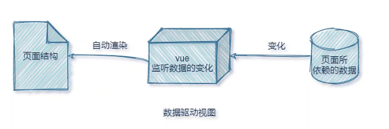
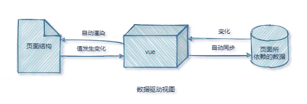
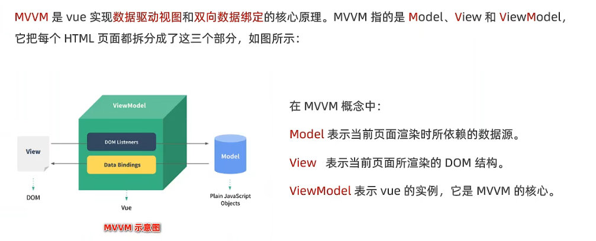
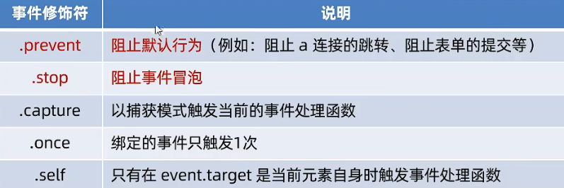
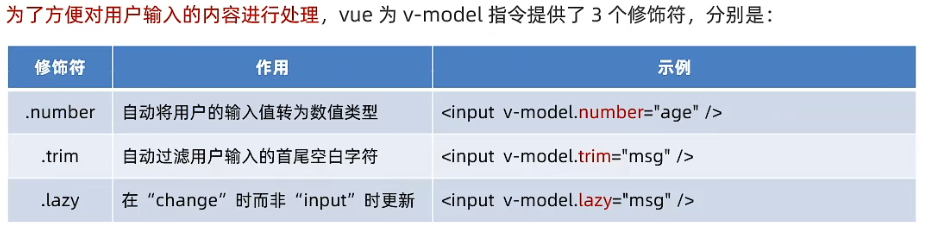

##  VUE的两大特征

### 一、数据驱动视图



数据的变化会驱动视图自动更新。

+ 好处！：程序员只管把数据维护好，那么页面结构会被 VUE 自动渲染出来。

### 二、双向数据绑定



> 在网页中，form 表单负责采集数据，Ajax 负责提交数据。  

JS 数据的变化，会被自动渲染到页面上，页面上表单采集的数据发生变化的时候，会被 vue 自动获取到，并更新到 JS 数据中。

- 好处!：程序员不再需要手动操作 DOM 元素，来获取表单元素最新的值。

## MVVM



## VUE的指令与过滤器

### 指令的概念

指令是 vue 为开发者提供的模板语法，用于辅助开发者渲染页面的基本结构。
vue中的指令按照**不同的用途**可以分为如下6大类：

### 内容渲染指令

`v-text`指令的缺点！：会覆盖元素内部原有的内容！不常用。
`{{ }}语法`专业名称是插值表达式。专门用来解决 v-text 会覆盖默认文本内容的问题。
`v-html`指令：上面两种指令只能渲染纯文本内容。如果要把包含 HTML 标签的字符串渲染出来，则需要使用此指令。

### 属性绑定指令

```html
<input type="text" placeholder="这是属性节点">
<p>这是内容节点</p>
```

注意！：插值表达式只能用在元素的**内容节点**中，不能用在**属性节点**中！

```vue
<div id="app">
	<input type="text" v-bind:placeholder="tips">
    <input type="text" :placeholder="tips"> //省略后的写法
</div>
```

`v-bind`指令，为元素的属性动态的绑定值。
注意！：因为v-bind指令使用频繁，所以 vue 规定可以 简写为 : 即可。

在使用 v-bind 指令绑定属性期间，如果需要进行动态拼接，则字符串应被单引号 ' ' 包裹，例如

```vue
<div :title="'box' + index">这是一个div</div>
```

### 事件绑定指令

`v-on`指令，用来辅助程序员为DOM元素绑定事件监听。

```vue
<div id="app">
	<p>count的值是:{{ count }}</p>
    <!-- 为 button 添加点击事件，addCount 一个事件的处理函数 -->
	<button v-on:click="addCount(n)">+1</button>
    <!-- v-on: 指令可简写为 @ -->
    <button @click="subCount">-1</button>
</div>
```

**那么事件的处理函数写在哪呢？**

```vue
// 创建 vue 的实例对象
const vm = new Vue({
    // el 属性是固定的写法，表示要控制的元素，接收的值是一个选择器
    el: "#app",
    // data 就是要渲染的数据
    data: {
        count: 0
    },
    methods: {
        addCount(n) {
            // vm.count += n;
			this.count += n; // this 指向实例对象 vm
        },
		subCount(){
            vm.count -= 1;
        }
    },
});
```

如果事件处理函数没有传参，默认会传递一个参数对象 e，但是如果传递参数之后，e 就会变成函数的形参，那该如何及传递参数又可以获取到事件对象 e 呢？

这里 vue 提供了内置的变量 $event ,它就是原生 DOM 的事件对象 e。

```
<button v-on:click="addCount(n, $event)">+1</button>
```

**事件修饰符**

```vue
<!-- 事件修饰符 .prevent 添加在了点击事件之后，这里是阻止了 a 链接的默认跳转行为 -->
<a href="https://www.baidu.com" @click.prevent="tz">跳转到百度</a>
```

相当于原生 js 的e.prevenDefault() 。常用的有：



**按键修饰符**

```vue
<div id="app">
	<input type="text" @keyup.E="clearInput" @keyup.esc="commitAjax">
</div>
```

点击键盘 E 触发 clearInput 事件，按 esc 触发 commitAjax 事件。

### 双向绑定指令

`v-model`双向数据绑定指令，用来辅助开发者在不操作 DOM 的前提下，快速获取表单的数据。

```vue
<!-- 这里让文本框与 username 进行双向绑定 -->
<input type="text" v-model="username">

const vm = new Vue({
	// el 属性是固定的写法，表示要控制的元素，接收的值是一个选择器
	el: "#app",
	// data 就是要渲染的数据
	data: {
		username: "zhangsan"
	}
});
```

注意！：双向绑定 div 没有意义，

```js
<div v-model="username"></div>
```

> 只有表单元素使用才有意义！例如：input 输入框、textarea、select 下拉菜单、

**v-model 的修饰符**



.number 示例：

> 如果没使用 .number 修饰符，修改 input 输入框中的值，会变成字符串类型。

```js
<input type="text" v-model.number="f1"> + <input type="text" v-model.number="f2"> = {{ f1 + f2}}
```

.trim 示例：略，只去除两端，中间不去除，如：zhang       san

.lazy 示例：略，类似于防抖！数据变化的时候不会实时的更新，只有失去焦点的时候才更新数据。啊

### 条件渲染指令

###  列表渲染指令