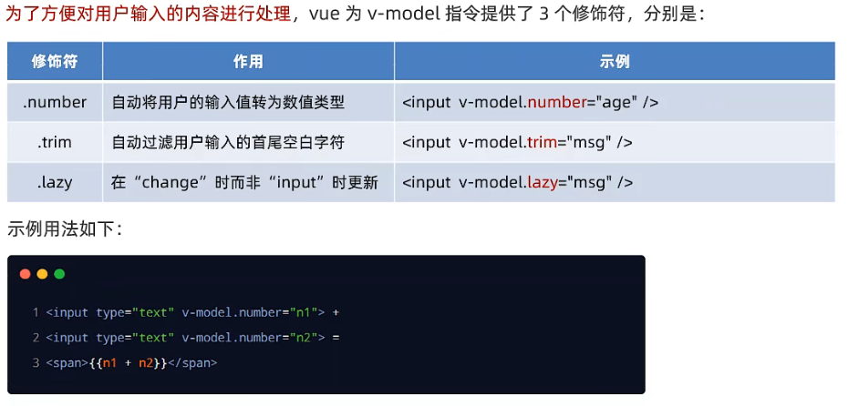

#  VUE的两大特征

## 一、数据驱动视图


数据的变化会驱动视图自动更新。

+ 好处！：程序员只管把数据维护好，那么页面结构会被 VUE 自动渲染出来。

## 二、双向数据绑定


> 在网页中，form 表单负责采集数据，Ajax 负责提交数据。  

JS 数据的变化，会被自动渲染到页面上，页面上表单采集的数据发生变化的时候，会被 vue 自动获取到，并更新到 JS 数据中。

- 好处!：程序员不再需要手动操作 DOM 元素，来获取表单元素最新的值。

# MVVM


# VUE的指令与过滤器

## 指令的概念

指令是 vue 为开发者提供的模板语法，用于辅助开发者渲染页面的基本结构。
vue中的指令按照**不同的用途**可以分为如下6大类：

### 内容渲染指令

`v-text`指令的缺点！：会覆盖元素内部原有的内容！不常用。
`{{ }}语法`专业名称是插值表达式。专门用来解决 v-text 会覆盖默认文本内容的问题。
`v-html`指令：上面两种指令只能渲染纯文本内容。如果要把包含 HTML 标签的字符串渲染出来，则需要使用此指令。

### 属性绑定指令

```html
<input type="text" placeholder="这是属性节点">
<p>这是内容节点</p>
```

注意！：插值表达式只能用在元素的**内容节点**中，不能用在**属性节点**中！

```vue
<div id="app">
	<input type="text" v-bind:placeholder="tips">
    <input type="text" :placeholder="tips"> //省略后的写法
</div>
```

`v-bind`指令，为元素的属性动态的绑定值。
注意！：因为v-bind指令使用频繁，所以 vue 规定可以 简写为 : 即可。

在使用 v-bind 指令绑定属性期间，如果需要进行动态拼接，则字符串应被单引号 ' ' 包裹，例如

```vue
<div :title="'box' + index">这是一个div</div>
```

### 事件绑定指令

`v-on`指令，用来辅助程序员为DOM元素绑定事件监听。

```vue
<div id="app">
	<p>count的值是:{{ count }}</p>
    <!-- 为 button 添加点击事件，addCount 一个事件的处理函数 -->
	<button v-on:click="addCount(n)">+1</button>
    <!-- v-on: 指令可简写为 @ -->
    <button @click="subCount">-1</button>
</div>
```

**那么事件的处理函数写在哪呢？**

```vue
// 创建 vue 的实例对象
const vm = new Vue({
    // el 属性是固定的写法，表示要控制的元素，接收的值是一个选择器
    el: "#app",
    // data 就是要渲染的数据
    data: {
        count: 0
    },
    methods: {
        addCount(n) {
            // vm.count += n;
			this.count += n; // this 指向实例对象 vm
        },
		subCount(){
            vm.count -= 1;
        }
    },
});
```

如果事件处理函数没有传参，默认会传递一个参数对象 e，但是如果传递参数之后，e 就会变成函数的形参，那该如何及传递参数又可以获取到事件对象 e 呢？

这里 vue 提供了内置的变量 $event ,它就是原生 DOM 的事件对象 e。

```
<button v-on:click="addCount(n, $event)">+1</button>
```

**事件修饰符**

```vue
<!-- 事件修饰符 .prevent 添加在了点击事件之后，这里是阻止了 a 链接的默认跳转行为 -->
<a href="https://www.baidu.com" @click.prevent="tz">跳转到百度</a>
```

相当于原生 js 的e.prevenDefault() 。常用的有：


**按键修饰符**

```vue
<div id="app">
	<input type="text" @keyup.E="clearInput" @keyup.esc="commitAjax">
</div>
```

点击键盘 E 触发 clearInput 事件，按 esc 触发 commitAjax 事件。

### 双向绑定指令

`v-model`双向数据绑定指令，用来辅助开发者在不操作 DOM 的前提下，快速获取表单的数据。

```vue
<!-- 这里让文本框与 username 进行双向绑定 -->
<input type="text" v-model="username">

const vm = new Vue({
	// el 属性是固定的写法，表示要控制的元素，接收的值是一个选择器
	el: "#app",
	// data 就是要渲染的数据
	data: {
		username: "zhangsan"
	}
});
```

注意！：双向绑定 div 没有意义，

```js
<div v-model="username"></div>
```

> 只有表单元素使用才有意义！例如：input 输入框、textarea、select 下拉菜单、

**v-model 的修饰符**



.number 示例：

> 如果没使用 .number 修饰符，修改 input 输入框中的值，会变成字符串类型。

```js
<input type="text" v-model.number="f1"> + <input type="text" v-model.number="f2"> = {{ f1 + f2}}
```

.trim 示例：略，只去除两端，中间不去除，如：zhang       san

.lazy 示例：略，类似于防抖！数据变化的时候不会实时的更新，只有失去焦点的时候才更新数据。

### 条件渲染指令

条件渲染指令用来辅助开发者按需控制 DOM 的显示与隐藏。条件渲染指令有如下两个：

**`v-if`**的原理是：每次动态的创建或移除元素，来实现元素的隐藏与显示。

+ `v-else`指令、`v-else-if`指令

  ```vue
  <p v-if="type == 'A'">优秀</p>
  <p v-else-if="type == 'B'">良好</p>
  <p v-else-if="type == 'C'">及格</p>
  <p v-else>差</p>
  ```

**注意！**：v-if="type == 'A'" 引号里面是 JS 代码，需要加给 A 加单引号，表示 A 是字符串类型。

>  如果刚进入页面的时候，某些元素不需要被展示，且后期这个元素很可能也不需要被展示出来，此时 v-if 的性能会更好。

**`v-show`**的原理是：动态的为元素添加或移除`display：none`样式，来实现元素的隐藏与显示。

> 如果需要频繁的切换元素的显示状态，用 v-show 性能更好。

```vue
 <div id="app">
    <button @click="change">Change flag</button>
    <p v-if="flag">这是被v-if控制的元素</p>
    <p v-show="flag">这是被v-show控制的元素</p>
</div>

data: {
    flag: true
},
methods: {
    change() {
    	this.flag = !this.flag;
    }
},
```

###  列表渲染指令

`V-for`用来辅助开发者**基于一个数组来循环渲染一个列表结构**。该指令需要使用 **item in items** 形式的特殊语法，其中：**items** 是待循环的数组， **item** 是被循环的每一项。

`v-for`还支持一个可选的第二个参数，即**当前项的索引**。语法格式为 **(item, index) in items**

+ **注意！**：只要用到了 v-for 指令，那么一定要在后面绑定一个 :**key** 属性！！！ 尽量使用当前项的 id 作为 key 的值，要保证**唯一性**。

+ **注意！**：使用 index 索引当作 key 没有意义！！！例如：

  一开始 key 绑定 index 为 1 的元素，名字为李四。

  | index      | id   | name |
  | ---------- | ---- | ---- |
  | 0          | 1    | 张三 |
  | 1   <= key | 2    | 李四 |

  向表格**前面**添加一个元素，index 会发生变化。

  | index     | id   | name |
  | --------- | ---- | ---- |
  | 0         | 3    | 王五 |
  | 1  <= key | 1    | 张三 |
  | 2         | 2    | 李四 |

  这时候 key 指向的元素却是 张三！！！所以不能用 index 作为 key 的值。

+ **key 的值**类型只能是 **字符串** 或 **数字** 类型。

```vue
<tr v-for="(item,index) in list" :key="item.id">
    <td>{{ index }}</td>
    <td>{{ item.id }}</td>
    <td>{{ item.name }}</td>
</tr>

data: {
    list: [
        { id: 0, name: "张三" },
        { id: 1, name: "李四" },
        { id: 2, name: "王五" }
    ]
}
```

循环渲染每一行 tr ，效果如图：


## 过滤器 （Vue3 已经不再使用）

过滤器是 vue 为开发者提供的功能，常用于**文本的格式化**。过滤器可以用在两个地方：**插值表达式**和 **v-bind 属性绑定**。

```vue
<p>message的内容是：{{ message | capi }}</p>

// filters 与 data 平级
filters:{
    // 这里的 val 是上面 “message | capi” ，管道符前面的值。 即 message
    capi(val){
        // chatAt(0) 获取字符串中 下标为0 的字符；toUpperCase() 大写，输出 => H
        const first = val.charAt(0).toUpperCase();
		// slice(1) ,从下标为 1 的元素截取，输出 => ello vus.js
        const other = val.slice(1);
        // 过滤器中一定要有一个返回值！
        return first + other; 输出 => Hello vus.js
    }
}
```

**过滤器的注意点**

+ 要定义到 filters 节点下，本质是一个函数，需要返回一个值。
+ 在过滤器的形参中可以获取到 **管道符 |** 前面待处理的那个值。
+ 如果私有过滤器和全局过滤器的**名字一致**，此时按照**就近原则**，调用的是私有过滤器。

### 私有过滤器

定义在 vm 实例当中的过滤器就是私有过滤器，如**上面**的代码。

### 全局过滤器

```
// 全局过滤器-独立于每个 vm 实例之外
// Vue.filter(), 接收两个参数，第一个参数是全局过滤器的 名字，第二个参数是全局过滤器 要处理的函数
Vue.filter("capi", (val) => {
	return Hello;
})
```

# 侦听器

## Watch侦听器

`wacth侦听器`允许开发者监视数据的变化，从而针对数据的变化做出特定的操作。

**所有**的侦听器都应该定义到 watch 节点下， watch 与 data 平级。侦听器本质上是一个**函数**，要侦听哪个数据的变化就把数据的名字作为函数名。例如：监听 username

```
data: {
    username: "张三",
    address:{
    	city: "北京"
    }
},
watch: {
    username(newVal, oldVal) {
    	console.log("变化了！", newVal, oldVal);
    	// newVal 是新值， oldVal 是旧值，自带属性。且新值在前，旧值在后。
    }
}
```

### 侦听器的格式

**方法格式的侦听器**

**缺点**：

+ **无法**在刚进入页面的时候**自动触发一次**。
+ 如果侦听的是**一个对象**，如果对象中的**属性**发生了变化，不会触发侦听器。

**对象格式的侦听器**

```
 watch: {
     username: {
		// 触发函数，handler 固定名称
		handler(newVal) {
			console.log(newVal)
		}
	,
	// immediate 默认值是false，即不自动触发侦听
	immediate: true,
	// 开启深度监听,只要对象中任何一个属性变化了，都会触发侦听器
	deep: true

	// -----------------------------
	// 如果要侦听的是对象上的指定子属性的变化，则需要包裹一层引号，与深度监听效果一致
	"info.username"(newVal) {
		console.log(newVal);
	}
 }
```

好处：

+ 可以通过 **immediate** 选项，让侦听器**自动**触发！
+ 可以通过 **deep** 选项，让侦听器深度侦听**对象中每个属性**的变化。**(深度监听)**

# 计算属性

计算属性指的是通过**一系列运算**之后，最终得到一个**属性值**。这个动态计算出来的属性值可以被模板结构或 methods 方法使用。

```
data: {},
computed: {
	// 所以的计算属性都要定义到 computed 节点之下
	// 计算属性在定义的时候要定义为“方法格式”
	rgb() {
		return ...;
	}
}
```

因为返回的是一个属性值，可以直接调用。

**特点**：

1. 定义的时候，要被定义为 “方法” 。
2. 在使用计算属性的时候，当普通的属性使用即可。

**好处**：

1. 实现了代码的复用。
2. 只要计算属性中依赖的数据源变化了，则计算属性重新求值。

# axios

axios 是专注于网络请求的库！

axios 的返回值是 Promise 。可以加 await / async 进行简化。

## 基本使用语法：

发起 GET 请求：

```js
// 调用 axios 方法得到的返回值是 Promise 对象
// 如果调用某个方法的返回值是 promise 实例，则前面可以添加 await ！
// await 只能用在被 async “修饰”的方法中
axios({
    method: "GET",
    url: "http://...",
    // URL 中的查询参数(GET)
    params:{},
    // 请求体参数(POST)
    data:{}
    }).then(function (data) {
		// 返回的数据
		console.log(data);
})
```

axios **直接发起 GET请求 和POST请求**：

```js
	<button id="btnGET">GET</button>
    <button id="btnPOST">POST</button>

    <script src="./lib/axios.js"></script>

    <script>
        document.querySelector("#btnGET").addEventListener("click", async function () {
            const { data: result } = await axios.get("http://www.liulongbin.top:3006/api/getbooks", {
                params: { id: 1 }
            })
            console.log(result.data);
        })

        document.querySelector("#btnPOST").addEventListener("click", async function () {
            const { data: result } = await axios.post("http://www.liulongbin.top:3006/api/post", {
                data: {
                    name: "zs",
                    sex: "男"
                }
            })
            console.log(result);
        })
    </script>
```

# vue-cli


# ES6 模块化

ES6 模块化规范是**浏览器端**和**服务器端**通用的模块化开发规范。它的出现极大的降低了前端开发者的模块化学习成本。

ES6 模块化规范中定义：

1. 每个 JS 文件都是一个独立的模块。
2. 导入其他模块成员使用 import 关键字。
3. 向外共享模块成员使用 export 关键字。

### 默认导出与默认导入

默认导出：

```js
let n1 = 10;
let n2 = 20;
function f1 = {};

export default{
	n1,
	f1
}
```

默认**导出**的注意事项！：

+ 每个模块中，只允许使用**唯一的一次** export default ，否则会报错。

默认导入:

```js
import "有意义的名字" from "./路径.js";

console.log("有意义的名字");
```

### 按需导出与按需导入

按需导出：

只需要在 **想导出的成员** 前加上 export ，即可。

**注意事项！**：

+ 每个模块中可以使用多次按需导出。

```js
// 按需导出
export let s1 = "aaa";
export let s2 = "bbb";
export function f1 = {};

//默认导出
export default{
	a:10;
}
```

按需导入：

**注意事项！**：

+ 按需**导入的成**员名称必须和按需**导出的名称一致**。
+ 按需导入时，可以使用 **as** 关键字进行重命名。
+ 按需导入可以和默认导入一起使用。

```js
// info 表示 默认导入 的一个成员
import info, {s1, s2 as str2, f1} from "./路径.js" 

console.log(s1); // 打印输出 aaa
console.log(str2); // 打印输出 bbb , 使用了 as 关键字进行重命名
console.log(f1); // 打印输出 [Function: f1]

console.log(info); // 打印输出 {a : 20}, 说明按需导入可以和默认导入一起使用！
```

### 直接导入并执行模块中的代码

如果只想单纯的执行某个模块中的代码，并不需要得到模块中向外共享的成员，可以直接导入并执行。

```js
for (let i = 0; i < 3; i++){
	console。log(i);
}

// ------------------------------------------ 分割线

import "./上面代码的路径.js"; // 打印输出 0，1，2
```

# 	Promise

多层回调函数的相互嵌套，就形成了**回调地狱**，示例如下：


**回调地狱的缺点！**：

+ 代码的耦合性太强，牵一发而动全身，难以维护。
+ 大量冗余的代码相互嵌套，代码的可读性变差。

所以在 ES6 中新增了 **Promise** 的概念来**解决**回调地狱。

## Promise 的基本概念

promise 是一个构造函数：

+ 我们可以创建 Promise 的实例 const p = new Promise();
+ new 出来的 Promise 实例对象，代表一个**异步操作**。

Promise.prototype 上包含一个 **.then()** 对象：

+ 每一次 new Promise() 构造函数得到的实例对象，都可以通过**原型链**的方式访问到 .then() 方法，例如 p.then();

.then() 方法用来预先指定成功和失败的回调函数：

+ p.then(result => {}, error => {})
+ 调用 .then() 方法时，**成功的回调函数是必选的**，失败的回调函数是可选的。

**通过 .catch(err => {}) 来捕获错误**。

## Promise.all() 方法

Promise.all() 方法会发起**并行**的 Promise 异步操作，等所有的异步操作**全部执行完毕**才会执行下一步的 .then() 操作（等待机制）。

## Promise.race() 方法

Promise.race() 方法会发起**并行**的 Promise 异步操作，只要**任何一个**异步操作完成，就立即执行下一步的 .then() 操作（赛跑机制）。

## 基于 Promise 封装读文件的方法

方法的封装要求：

1. 方法名为 getFile。
2. 方法接收一个形参 fpath ，表示要读取文件的路径。
3. 方法的返回值为 Promise 实例对象。

**getFile 方法的基本定义**

```js
// node.js 自带
import fs from "fs";

function getFile(fpach) {
	// 方法的返回值是一个 Promise 对象
	return new Promise(function (resolve, reject) {
        // 下面这行代码表示，这是一个具体的、读文件的异步操作
        fs.readFile(fpach, "utf-8", (err, dataStr) => {
        	// 如果读取失败，则调用 失败的回调函数
            if (err) {
                return reject (err);
            }
            // 如果读取成功，则调用 成功的回调函数
            resolve (dataStr)
    	});
    });
}
```

# async/await 的基本使用

使用 async/await 简化 Promise 异步操作。

如果用 await 来修饰一个返回值为 Promise 的函数，它的返回值不再是 Promise ，而是真正的值。

如果方法内部用到了 await ，则这个方法**必须**被 async 修饰。

**注意！**：在 async 方法中，**第一个 await 之前的代码会同步执行**，await 之后的代码会异步执行。

所以下图中 getAllFile() 方法中 B 是同步执行的，剩余方法后面的内容全是异步执行的，所以先完成同步执行，再完成异步执行。


输出结果为：


# EventLoop

JavaScript 是一门**单线程执行**的语言，就是说，同一时间只能做一件事情。


单线程执行任务队列的问题：

如果前一个任务非常耗时，则后续的任务就会一直等待，从而导致**程序假死**的问题。

## 同步任务和异步任务

为了防止某个耗时任务导致程序假死的问题，JS 把待执行任务分为了同步任务和异步任务。

同步任务（synchronous）：

+ 又叫做**非耗时任务**，指的是再主线程上排队执行的哪些任务。
+ 只有前一个任务执行完毕，才能执行下一个任务。

异步任务（**async**hronous）：

+ 又叫做**耗时任务**，异步任务由 JavaScript 委托给宿主环境 (JS的执行环境) 进行执行。
+ 当异步任务执行完成后，会通知 JavaScript  主线程执行异步任务的回调 函数。

## EventLoop的基本概念：


执行栈把异步任务委托给宿主环境执行，当宿主环境将异步任务执行完毕之后，会把对应的回调函数放入任务队列中，当 JS 把执行栈中的同步任务都执行完毕之后，会主动将任务队列中的异步任务的回调函数取出来放入执行栈中去执行。

> 把异步任务的回调函数从任务队列取出来放入执行栈的过程是循环不断的，所以整个的运行机制又称为EventLoop（事件循环）。

# 宏任务和微任务

## 什么是宏任务和微任务

JavaScript 把异步任务又做了进一步的划分，分为两类：宏任务和微任务。

宏任务（macrotask）:

+ 异步 Ajax 请求
+ setTimeout、setInterval
+ 文件操作
+ 其他宏任务

微任务（microtask）:

+ promise.then 、 .catch 和 .finally
+ process.nextTick
+ 其他微任务

宏任务和微任务的执行顺序：


每一个**宏、同步任务**执行完毕之后，都会检查是否存在待执行的微任务，如果有，执行所有微任务，结束之后再执行下一个微任务。

若一个宏任务中又包含了宏任务与微任务，也是先执行里面的宏任务。

同步任务 | **->** 微任务 **->** 宏任务 **->** 微任务 **->** ...


